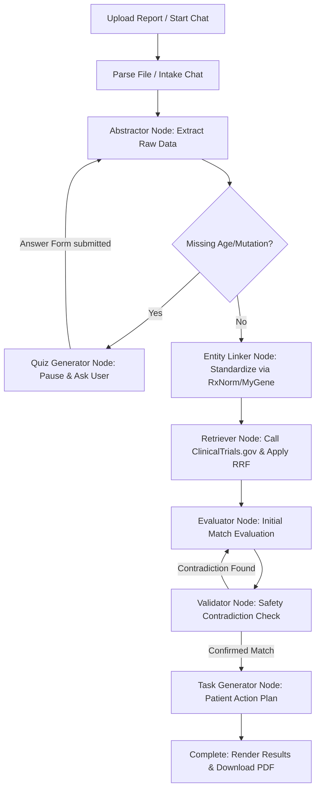

# OrphanLink: Autonomous Clinical Trial Matching Portal

OrphanLink is an AI-powered B2B portal designed to seamlessly match patient biomarker reports with complex ClinicalTrials.gov criteria. Powered by a self-correcting LangGraph state-machine orchestrator, entity standardization APIs, hybrid semantic search, and an interactive intake chatbot, OrphanLink ensures highly precise, zero-hallucination patient-to-trial mapping.

---

## ✨ Key Features & Core Components

### 1. Dynamic File Ingestion & Intelligent OCR Fallback
Patients or clinicians can upload medical reports in PDF, JSON, or TXT formats.
- **Digital PDFs**: Extracted instantly using `PyMuPDF`.
- **Scanned Reports**: Automatically detects scanned documents (text length < 50 chars) and falls back to OCR processing using `pdf2image` and `pytesseract`.
- **Boilerplate Reduction**: The parser automatically truncates text to the first 7,500 characters. This isolates the core patient diagnostic details (Pages 1–3) while discarding generic, verbose lab Methods and Limitations pages—minimizing token usage and preventing LLM context overload.

### 2. Zero-Hallucination Agentic LangGraph Orchestrator
The core routing and evaluation logic is driven by a LangGraph state machine orchestrating specialized agent nodes:
- **Abstractor Agent**: Extracts critical patient indicators (age, mutations, prior treatments) into a strict JSON schema.
- **Quiz Generator Agent**: Pauses the workflow if critical matching fields are missing, generating plain-English questions for the patient. Once answered, the graph resumes contextually.
- **Evaluator Agent**: Evaluates patient data against inclusion/exclusion criteria, yielding a `"MATCH"` or `"EXCLUDED"` status backed by exact verbatim quotes.
- **Validator Agent (Safety Loop)**: A secondary agent that double-checks all evaluated `"MATCH"` cases. If a contradiction is detected (e.g., a hidden exclusion criterion was violated), it routes the state machine back to the Evaluator node with structured critique for self-correction.
- **Task Generator Agent**: Synthesizes matches into a personalized patient checklist (next steps, oncological consult, scheduling).

### 3. API-Driven Biomarker Standardization (Entity Linking)
Raw terminology from patient reports is normalized to scientific standards using public medical databases:
- **Therapies**: Normalized via the **RxNorm API** to map drug brand names to their active pharmaceutical ingredients.
- **Genetic Mutations**: Standardized via the **MyGene.info API** to link gene aliases to official symbols.

### 4. Real-Time Retrieval & Hybrid Semantic Search
- Queries are constructed using standardized keywords and searched against the official **ClinicalTrials.gov V2 API** in real-time.
- Trials are chunked and ranked locally using a hybrid search algorithm (**ChromaDB** for dense vector similarity + **Rank-BM25** for sparse text matching), merged via **Reciprocal Rank Fusion (RRF)**.

### 5. Robust LLM Rate-Limit Resilience
- Utilizes a custom `RobustChatModel` proxy wrapper in the backend. 
- It intercepts Groq API `429 Rate Limit` exceptions, extracts the indicated wait duration (TPM limit), sleeps dynamically, and retries the execution up to 6 times to guarantee seamless pipeline completion.

### 6. Premium Whole-Site Dark Theme & Responsive Navigation
- **Universal Dark Mode**: Seamlessly switches the entire page layout—including body background, gateway cards, chatbot panels, matching boards, overlays, and task lists—using a cohesive deep-navy dark aesthetic.
- **Tactile Branding & State Reset**: Brand logo in the header functions as an active system indicator (featuring a validation status light) and resets the portal state back to the landing page upon click.

---

## 🔄 End-to-End Workflow Diagram



---

## 🏗️ Architecture & Technology Stack

- **Frontend**: Next.js 15 (App Router), React, Lucide Icons, Tailwind CSS, `shadcn/ui`.
- **Backend**: FastAPI, LangGraph (Agent state machine), ChromaDB (Vector database), Rank-BM25 (Sparse search).
- **AI Models**: `meta-llama/llama-3.1-8b-instant` via the Groq API.
- **APIs**: ClinicalTrials.gov V2, RxNorm REST, MyGene.info.
- **Parsing**: PyMuPDF (`fitz`), Tesseract OCR (`pytesseract`), `pdf2image`.

---

## 🚀 Getting Started (Local Development)

### 1. Install System OCR Dependencies
For OCR fallbacks to function properly, install Tesseract and Poppler:
```bash
# Ubuntu/Linux
sudo apt-get update && sudo apt-get install -y tesseract-ocr poppler-utils
```

### 2. Set Up Variables
Ensure your credentials are set up inside `backend/.env`:
```env
GROQ_API_KEY=gsk_your_groq_api_key
```

### 3. Launch Development Environments
We provide a unified orchestrator script that boots the FastAPI backend, Next.js frontend, and Localtunnel concurrent processes:
```bash
# From the project root
python3 start_dev.py
```
*   **Web Portal**: `http://localhost:3000` (or `http://localhost:3001` if port 3000 is occupied).
*   **Backend API Docs**: `http://localhost:8000/docs`.

---

## 🛠️ Verification & Pipeline Testing

A dedicated test suite is available to simulate patient report uploads:
```bash
# Test file uploads, SSE stream listening, quiz handling, and final matches:
./backend/venv/bin/python test_invitae_pipeline.py
```
This script uploads the positive breast cancer sample report [Invitae - SR272_Invitae_Sample_Report_BRCA2_Positive.pdf](file:///home/dhruvi/OrphanLink/Invitae%20-%20SR272_Invitae_Sample_Report_BRCA2_Positive.pdf), responds to the missing age quiz, and prints the matched trials along with the personalized action plan.
