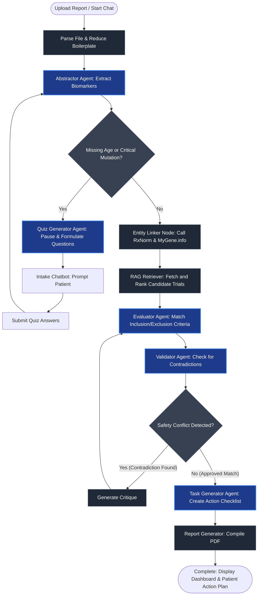
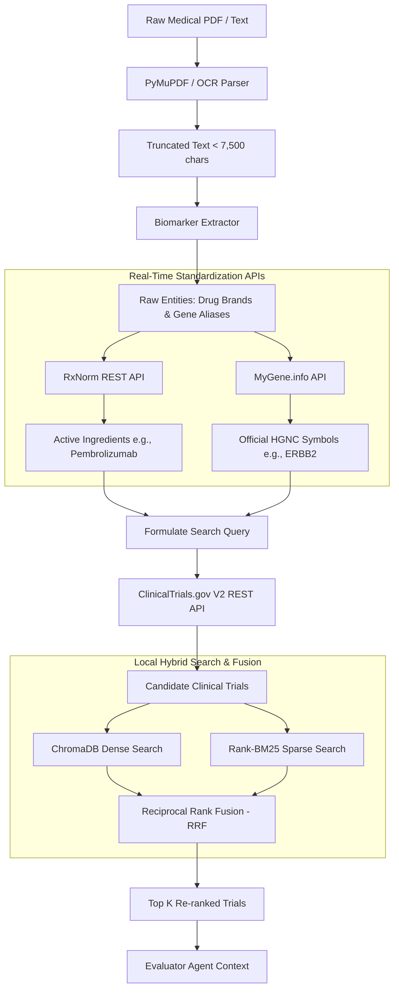

# OrphanLink: Autonomous Clinical Trial Matching Portal

OrphanLink is an AI-powered B2B portal designed to seamlessly match patient biomarker reports with complex ClinicalTrials.gov criteria. Powered by a self-correcting LangGraph state-machine orchestrator, entity standardization APIs, hybrid semantic search, and an interactive intake chatbot, OrphanLink ensures highly precise, zero-hallucination patient-to-trial mapping.

---

## 🩺 Problem Statement & The OrphanLink Pitch

### The Problem
Matching cancer and rare disease patients to appropriate clinical trials is one of the most critical yet severely bottlenecked steps in modern oncology and precision medicine:
*   **Overwhelming Search Space**: With over 450,000 active listings on ClinicalTrials.gov, manual review of eligibility criteria is incredibly slow, keeping patients waiting when time is of the essence.
*   **Terminology Mismatch**: Patient lab reports mention brand-name therapies (e.g., Keytruda) or common gene aliases (e.g., HER2), while clinical trials reference active chemical ingredients (pembrolizumab) or official HGNC symbols (ERBB2).
*   **Incomplete Clinical Context**: Patient-uploaded medical reports are frequently missing critical eligibility details like exact age, specific tumor staging, or lines of prior therapy, leading to immediate false negatives or misaligned matches.
*   **AI Hallucinations & Safety Risks**: Conventional LLM parsers easily misinterpret negation rules in inclusion/exclusion criteria, leading to unsafe match validations or missed exclusion terms (hallucinations).

### The OrphanLink Solution (Why OrphanLink?)
OrphanLink solves these challenges through a unified, patient-centric, B2B clinical trial matchmaking portal:
1.  **AI-Driven Standardized Entity Linking**: Dynamically normalizes unstructured mutations and therapeutics to scientific standards via real-time RxNorm and MyGene.info API integrations.
2.  **Intelligent Human-in-the-Loop Clarification**: If critical biomarkers or demographic fields are missing, the LangGraph orchestrator dynamically triggers a personalized, plain-English quiz via the intake chatbot to gather details from the patient before proceeding.
3.  **Hybrid Dense-Sparse Local RAG**: Fetches live candidate trials from ClinicalTrials.gov V2, indexes them in a local vector database, and applies hybrid search (ChromaDB vector similarity + Rank-BM25) with Reciprocal Rank Fusion (RRF) for top-tier trial relevance.
4.  **Self-Correcting Multi-Agent Verification Loop**: An **Evaluator Agent** performs initial match evaluation supported by exact verbatim text evidence, while a secondary **Validator Agent** scrutinizes matches for hidden exclusions. If a contradiction is detected, a structured feedback critique triggers automatic Evaluator self-correction.

---

## ✨ Key Features & Core Components

### 1. Dynamic File Ingestion & Intelligent OCR Fallback
Patients or clinicians can upload medical reports in PDF, JSON, or TXT formats.
- **Digital PDFs**: Extracted instantly using `PyMuPDF`.
- **Scanned Reports**: Automatically detects scanned documents (text length < 50 chars) and falls back to OCR processing using `pdf2image` and `pytesseract`.
- **Boilerplate Reduction**: The parser automatically truncates text to the first 7,500 characters. This isolates the core patient diagnostic details (Pages 1–3) while discarding generic, verbose lab Methods and Limitations pages—minimizing token usage and preventing LLM context overload.

### 2. Zero-Hallucination Agentic LangGraph Orchestrator
The core routing and evaluation logic is driven by a LangGraph state machine orchestrating specialized agent nodes:
- **Abstractor Agent**: Extracts critical patient indicators (age, mutations, prior treatments) into a strict JSON schema.
- **Quiz Generator Agent**: Pauses the workflow if critical matching fields are missing, generating plain-English questions for the patient. Once answered, the graph resumes contextually.
- **Evaluator Agent**: Evaluates patient data against inclusion/exclusion criteria, yielding a `"MATCH"` or `"EXCLUDED"` status backed by exact verbatim quotes.
- **Validator Agent (Safety Loop)**: A secondary agent that double-checks all evaluated `"MATCH"` cases. If a contradiction is detected (e.g., a hidden exclusion criterion was violated), it routes the state machine back to the Evaluator node with structured critique for self-correction.
- **Task Generator Agent**: Synthesizes matches into a personalized patient checklist (next steps, oncological consult, scheduling).

### 3. API-Driven Biomarker Standardization (Entity Linking)
Raw terminology from patient reports is normalized to scientific standards using public medical databases:
- **Therapies**: Normalized via the **RxNorm API** to map drug brand names to their active pharmaceutical ingredients.
- **Genetic Mutations**: Standardized via the **MyGene.info API** to link gene aliases to official symbols.

### 4. Real-Time Retrieval & Hybrid Semantic Search
- Queries are constructed using standardized keywords and searched against the official **ClinicalTrials.gov V2 API** in real-time.
- Trials are chunked and ranked locally using a hybrid search algorithm (**ChromaDB** for dense vector similarity + **Rank-BM25** for sparse text matching), merged via **Reciprocal Rank Fusion (RRF)**.

### 5. Robust LLM Rate-Limit Resilience
- Utilizes a custom `RobustChatModel` proxy wrapper in the backend. 
- It intercepts Groq API `429 Rate Limit` exceptions, extracts the indicated wait duration (TPM limit), sleeps dynamically, and retries the execution up to 6 times to guarantee seamless pipeline completion.

### 6. Premium Whole-Site Dark Theme & Responsive Navigation
- **Universal Dark Mode**: Seamlessly switches the entire page layout—including body background, gateway cards, chatbot panels, matching boards, overlays, and task lists—using a cohesive deep-navy dark aesthetic.
- **Tactile Branding & State Reset**: Brand logo in the header functions as an active system indicator (featuring a validation status light) and resets the portal state back to the landing page upon click.

---

## 🔄 Project Workflows & System Architecture

### 1. Agentic Workflow (LangGraph State Machine)
The core matching engine is designed as a stateful, self-correcting LangGraph state-machine that routes data through specialized agent nodes:



### 2. Hybrid RAG Architecture (Retrieval & Standardization)
To ensure the Evaluator Agent operates with zero-hallucinations, OrphanLink uses a multi-stage Hybrid Retrieval-Augmented Generation (RAG) pipeline:



---

## 🏗️ Architecture & Technology Stack

- **Frontend**: Next.js 15 (App Router), React, Lucide Icons, Tailwind CSS, `shadcn/ui`.
- **Backend**: FastAPI, LangGraph (Agent state machine), ChromaDB (Vector database), Rank-BM25 (Sparse search).
- **AI Models**: `meta-llama/llama-3.1-8b-instant` via the Groq API.
- **APIs**: ClinicalTrials.gov V2, RxNorm REST, MyGene.info.
- **Parsing**: PyMuPDF (`fitz`), Tesseract OCR (`pytesseract`), `pdf2image`.

---

## 🚀 Getting Started (Local Development)

### 1. Install System OCR Dependencies
For OCR fallbacks to function properly, install Tesseract and Poppler:
```bash
# Ubuntu/Linux
sudo apt-get update && sudo apt-get install -y tesseract-ocr poppler-utils
```

### 2. Set Up Variables
Ensure your credentials are set up inside `backend/.env`:
```env
GROQ_API_KEY=gsk_your_groq_api_key
```

### 3. Launch Development Environments
We provide a unified orchestrator script that boots the FastAPI backend, Next.js frontend, and Localtunnel concurrent processes:
```bash
# From the project root
python3 start_dev.py
```
*   **Web Portal**: `http://localhost:3000` (or `http://localhost:3001` if port 3000 is occupied).
*   **Backend API Docs**: `http://localhost:8000/docs`.

---

## 🛠️ Verification & Pipeline Testing

A dedicated test suite is available to simulate patient report uploads:
```bash
# Test file uploads, SSE stream listening, quiz handling, and final matches:
./backend/venv/bin/python test_invitae_pipeline.py
```
This script uploads the positive breast cancer sample report [Invitae - SR272_Invitae_Sample_Report_BRCA2_Positive.pdf](file:///home/dhruvi/OrphanLink/Invitae%20-%20SR272_Invitae_Sample_Report_BRCA2_Positive.pdf), responds to the missing age quiz, and prints the matched trials along with the personalized action plan.


The Pitch-Ready Script
If a judge asks you this, you can use this exact response:

"That is a great question. OrphanLink is designed as a B2B2C platform, meaning our primary target market—the ones who would integrate and pay for this system—are oncology clinics and research networks.

Right now, clinicians are severely bottlenecked; they simply do not have the billable hours to manually cross-reference a patient's biomarker report against 450,000 trials on ClinicalTrials.gov. We are building this to be their ultimate co-pilot.

However, the interface is intentionally patient-centric. We designed features like the plain-English intake chatbot and the personalized action checklists specifically so the platform can interact directly with the patient to gather missing information, like age or prior treatments, before it hits the doctor's desk.

So, we empower the clinician with zero-hallucination medical matching, while giving the patient an accessible, guided experience."